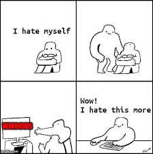

</img>

# doc

A simple Rust CLI tool to manage Docker Compose environments with VPN support.

## Quick Start

1. **Build the tool:**
   ```sh
   cargo build --release
   ```

2. **Add your VPN credentials to `.env`:**
   ```
   NORDVPN_USER=your_service_username
   NORDVPN_PASSWORD=your_service_password
   NORDVPN_COUNTRY=Norway
   ```

3. **Start services:**
   ```sh
   ./target/release/doc start <CONTAINER>
   ```

   Where `<CONTAINER>` is one of:

   * `snublejuice`
   * `javascript`
   * `torrenting`
   * `python`
   * `pyjs`
   * `rust`
   * `cpp`

## Commands

```sh
doc list                         # List available containers
doc run <CONTAINER> <cmd> ...    # Run a command in a container, stopping it afterwards
doc build <CONTAINER>            # Build the container
doc start <CONTAINER>            # Start the container
doc shell <CONTAINER>            # Enter container shell
doc status <CONTAINER>           # Check container and VPN status
doc test <CONTAINER>             # Test container VPN status
doc stop <CONTAINER>             # Stop the container
doc logs <CONTAINER>             # View logs
doc clean <CONTAINER>            # Clean up container
```

## Requirements

- Docker and Docker Compose
- NordVPN account (service credentials)
- Rust (for building CLI tool)